# Journey Selection Screen UI Specifications

This document outlines the layout, visual hierarchy, styling, and typography elements used for Screen 2 (Journey Selection) of the onboarding flow to match the design specifications.

---

## 📸 Layout & Visual Hierarchy

The screen uses a clean, cream-colored background with centered vertical elements and a symmetric grid of journey option chips, followed by a voice text bio area and a sticky action button.

```mermaid
graph TD
    subgraph Onboarding Screen 2 Layout
    A[Background Color: Light Cream] --> B[SafeArea Content Column]
    
    subgraph SafeArea Content Column
    B --> C[Progress Dots: Index 1 active out of 3]
    C --> D[Spacer height: 32]
    D --> E[Title: What makes your journey yours?]
    E --> F[Spacer height: 8]
    F --> G[Subtitle: Chamomile listens better...]
    G --> H[Spacer height: 20]
    H --> I[Journey Option Chips Grid: Symmetrical Column Rows]
    I --> J[Spacer height: 20]
    J --> K[VoiceTextArea Bio Container]
    K --> L[Expanded View Scroll Area End]
    L --> M[Sticky Bottom CTA Container]
    
    subgraph Sticky Bottom CTA Container
    M --> N[CTA Button: Continue]
    N --> O[Spacer height: 8]
    O --> P[Link: I'll share this later]
    end
    end
    end
```

---

## 🎨 Visual Specifications

### 1. General Style
- **Background Color**: Clean light cream/beige (`Color(0xFFF5F0E8)`).
- **Progress Indicators**: 3 horizontal pill dots at the top center.
  - **Active Dot**: Index 1 (middle dot) is wider (`width: 22dp`, `height: 7dp`), colored in brand rose-pink (`Color(0xFFB8706A)`).
  - **Inactive Dots**: Circular dots (`width: 7dp`, `height: 7dp`), colored in light beige/grey (`Color(0xFFE8DDD5)`).

### 2. Title & Headers
- **Main Heading**:
  - **Text**: `"What makes your journey yours?"`
  - **Typography**: Elegant Serif (`Playfair Display`, bold/w700)
  - **Font Size**: `30pt`
  - **Color**: Dark brown-grey (`Color(0xFF2C2825)`).
  - **Alignment**: Centered.
- **Subtitle**:
  - **Text**: `"Chamomile listens better when she knows you a little more. Take what feels right, leave what doesn't."`
  - **Typography**: Serif Italic (`Cormorant Garamond`, italic/w400)
  - **Font Size**: `16pt`
  - **Color**: Muted grey-brown (`Color(0xFF8A7D76)`).
  - **Alignment**: Centered.

### 3. Journey Options Chips Grid
- **Selection Rule**: Multi-select (allows selecting multiple items that apply).
- **Chip Button Style**:
  - **Shape**: Pill-shaped with fully rounded borders (`BorderRadius.circular(30)`).
  - **Unselected State**: Solid white background, thin beige border (`Color(0xFFE8DDD5)`), muted text.
  - **Selected State**: Light gold-tinted background (`Color(0xFFC4945A)` at 20% opacity), dark gold border and bold gold text (`Color(0xFFC4945A)`).
  - **Text Alignment**: Centered inside the pill shape.
- **Grid Layout**: Journey option chips wrap naturally inside a centered `Wrap` widget.

### 4. Voice Text Area (Bio input)
- **Container Box**:
  - **Width**: Expands to full horizontal width.
  - **Background**: Solid White.
  - **Border**: Rounded border radius of `18dp` with a thin border.
- **Text Alignment**: Left-aligned (`TextAlign.start`).
- **Placeholder Style**:
  - **Text**: `"Or just tell Chamomile anything about you, in your own words..."`
  - **Typography**: Elegant Serif Italic (`Cormorant Garamond`, italic/w400, size `15pt`) in muted color.
- **Speech Recognition Button**:
  - A circular white button aligned **inside** the textarea in the bottom-right corner.

### 5. Sticky Bottom Action Area
- **Position**: Locked at the bottom of the screen (`SafeArea`), outside the scroll view.
- **Primary CTA Button**:
  - **Label**: `"Continue →"`
  - **Typography**: Serif (`Playfair Display`, bold, size `17pt`).
  - **Background**: Warm pink-rose background with solid white text.
- **Skip Link**:
  - **Label**: `"I'll share this later"`
  - **Typography**: Sans-serif (`Lato`, normal/w400, size `13pt`).
  - **Style**: Underlined, muted text, positioned directly below the CTA button.
