# Name & Phase Selection Screen UI Specifications

This document outlines the layout, visual hierarchy, styling, and typography elements used for Screen 1 (Name & Phase Selection) of the onboarding flow to match the design specifications.

---

## 📸 Layout & Visual Hierarchy

The screen uses a clean, cream-colored background with centered vertical elements, transitioning from user identification to motherhood stage selection.

```mermaid
graph TD
    subgraph Onboarding Screen 1 Layout
    A[Background Color: Light Cream] --> B[SafeArea Content Column]
    
    subgraph SafeArea Content Column
    B --> C[Progress Dots: Index 0 active out of 3]
    C --> D[Spacer height: 32]
    D --> E[Title: What should we call you?]
    E --> F[Spacer height: 8]
    F --> G[Subtitle: You are more than a mother...]
    G --> H[Spacer height: 24]
    H --> I[Name Input Container: VoiceTextInput]
    I --> J[Spacer height: 32]
    J --> K[Motherhood Header: Where are you in your motherhood right now?]
    K --> L[Tagline: Motherhood holds many seasons...]
    L --> M[Spacer height: 16]
    M --> N[Motherhood Phase Chips Grid: 2-Column Row Layout]
    N --> O[Spacer height: 24]
    O --> P[Child Count Row: How many little ones? + Stepper]
    P --> Q[CTA Button: Continue]
    end
    end
```

---

## 🎨 Visual Specifications

### 1. General Style
- **Background Color**: Clean light cream/beige (`Color(0xFFF5F0E8)`).
- **Progress Indicators**: 3 horizontal pill dots at the top center. 
  - **Active Dot**: Wider pill (`width: 22dp`, `height: 7dp`), colored in brand rose-pink (`Color(0xFFB8706A)`).
  - **Inactive Dots**: Circular dots (`width: 7dp`, `height: 7dp`), colored in light beige/grey (`Color(0xFFE8DDD5)`).

### 2. Title & Headers
- **Main Heading**:
  - **Text**: `"What should we call you?"`
  - **Typography**: Elegant Serif (`Playfair Display`, bold/w700)
  - **Font Size**: `30pt`
  - **Color**: Dark brown-grey (`Color(0xFF2C2825)`).
  - **Alignment**: Centered.
- **Subtitle**:
  - **Text**: `"You are more than a mother. Let's start with you."`
  - **Typography**: Serif Italic (`Cormorant Garamond`, italic/w400)
  - **Font Size**: `16pt`
  - **Color**: Muted grey-brown (`Color(0xFF8A7D76)`).
  - **Alignment**: Centered.

### 3. Voice Text Input (Name field)
- **Container Box**:
  - **Width**: Expands to full horizontal width.
  - **Background**: Solid White.
  - **Border**: Rounded border radius of `16dp` with a thin accent border.
- **Text Alignment**: Left-aligned (`TextAlign.start`).
- **Placeholder Style**:
  - **Text**: `"Your name..."`
  - **Typography**: Elegant Serif Italic (`Cormorant Garamond`, italic/w400, size `22pt`) in muted color.
- **Speech Recognition Button**:
  - A circular white button aligned **inside** the input box container on the right side.

### 4. Motherhood Phase Grid (Single Selection)
- **Selection Rule**: Single-select ("choose one at a time"). Tapping a new selection replaces the previous choice.
- **Header**: `"Where are you in your motherhood right now?"` (Italic Serif, size `16pt`).
- **Tagline**: `"Motherhood holds many seasons — choose where you are right now."` (Sans-serif `Lato`, size `13pt`).
- **Grid Layout**: Pill chips wrap naturally inside a centered `Wrap` widget.
- **Chip Button Style**:
  - **Shape**: Pill-shaped with fully rounded borders (`BorderRadius.circular(30)`).
  - **Unselected State**: Solid white background, thin beige border (`Color(0xFFE8DDD5)`), muted text.
  - **Selected State**: Light pink-tinted background (`Color(0xFFB8706A)` at 20% opacity), dark pink border and bold pink text (`Color(0xFFB8706A)`).
  - **Text Alignment**: Centered inside the pill shape.

### 5. Stepper Row (Little Ones Count)
- **Layout**: Centered horizontal row grouping:
  - **Label**: `"How many little ones?"` (Italic Serif, size `16pt`).
  - **Minus/Plus Stepper Buttons**: White circular containers with dark grey `−` and `+` symbols.
  - **Count Number**: Bold Serif (`Playfair Display`, size `22pt`) centered between buttons.

### 6. Primary Action Button (Sticky Bottom Layout)
- **Position**: Locked at the bottom of the screen (`SafeArea`), outside the scroll view. The selection of chips or dynamic expansion of items (e.g. pregnancy month selector) will only scroll the content above, keeping the button static at the bottom.
- **Label**: `"Continue →"`
- **Typography**: Serif (`Playfair Display`, bold, size `17pt`).
- **Disabled State** (if name field is empty): Light beige background (`Color(0xFFE8DDD5)`), muted grey text.
- **Enabled State**: Warm pink-rose background with solid white text.
