# Welcome Screen UI Specifications

This document outlines the layout, visual hierarchy, styling, and typography elements used to match the "Me Time Club" Welcome/Landing screen as shown in the screenshot.

---

## 📸 Layout & Visual Hierarchy

The Welcome screen acts as the initial landing stage of the onboarding flow (`OnboardingScreen`), utilizing a centered vertical layout stacked over a photographic background.

```mermaid
graph TD
    subgraph Welcome Screen Layout
    A[Background Image: Wildflowers] --> B[Overlay 1: Soft Vignette Gradient]
    B --> C[Overlay 2: Dark Vignette Layer]
    C --> D[SafeArea Content Column]
    
    subgraph SafeArea Content Column
    D --> E[Spacer flex: 3]
    E --> F[Brand Heading: Me Time Club]
    F --> G[Subtitle: Your daily sanctuary]
    G --> H[Horizontal Red Divider Line]
    H --> I[Description: A calm, intelligent companion...]
    I --> J[Spacer flex: 2]
    J --> K[Primary CTA Button: Welcome to Me Time Club]
    K --> L[Secondary Link: or Login]
    L --> M[Bottom Tagline: Meet Chamomile...]
    end
    end
```

---

## 🎨 Visual Specifications

### 1. Background Layer
- **Imagery**: A soft, out-of-focus background depicting chamomile flowers in a meadow during golden hour (`assets/chamomile_background.png`).
- **Color Overlay**: A semi-transparent dark tint (`Color(0xFF2C2825)`) with an opacity of **65%** (`withValues(alpha: 0.65)`) to reduce visual noise and improve reading contrast.
- **Vignette Gradient**: A vertical gradient fade to darken the top and bottom edges:
  - **Top**: `Colors.black` at 20% opacity.
  - **Middle**: Transparent.
  - **Bottom**: `Colors.black` at 60% opacity.

### 2. Branding & Title Block
- **Brand Title**: 
  - **Text**: `"Me Time Club"`
  - **Typography**: Elegant Serif (`Playfair Display`, bold/w700)
  - **Font Size**: `38pt`
  - **Color**: Creamy off-white (`Color(0xFFF5F0E8)`)
  - **Alignment**: Center-aligned.
- **Subtitle**:
  - **Text**: `"Your daily sanctuary."`
  - **Typography**: Elegant Serif Italic (`Cormorant Garamond`, italic/w400)
  - **Font Size**: `20pt`
  - **Color**: Muted Gold (`Color(0xFFC4945A)`)
  - **Alignment**: Center-aligned.
- **Divider**:
  - **Style**: Centered short line.
  - **Color**: Terracotta/Rose Pink (`Color(0xFFB8706A)`) at 60% opacity.
  - **Dimensions**: Width `44dp`, Height `1.5dp`.
  - **Margins**: `20dp` vertical margin spacing.

### 3. Description Block
- **Text**: `"A calm, intelligent companion for every\nseason of motherhood."`
- **Typography**: Sans-Serif (`Lato`, normal/w400)
- **Font Size**: `14.5pt`
- **Color**: Off-white with 80% opacity (`Color(0xFFF5F0E8)`).
- **Line Height**: `1.6` for optimal readability.
- **Alignment**: Center-aligned.

### 4. Primary Call to Action (CTA) Button
- **Gesture Action**: Triggers step progression into the onboarding flow (`_next`).
- **Button Container**:
  - **Width**: Fills parent width (`double.infinity`).
  - **Padding**: Vertical padding of `16dp`.
  - **Background Color**: Rose/Terracotta Pink (`Color(0xFFB8706A)` at 85% opacity).
  - **Border Radius**: `16dp` rounded corners.
  - **Drop Shadow**: Diffusion shadow using `Color(0xFFB8706A)` at 33% opacity, offset `(0, 4)` downward, blur radius `20dp`.
- **Text Label**:
  - **Text**: `"Welcome to Me Time Club"`
  - **Typography**: Elegant Serif (`Playfair Display`, bold/w700)
  - **Font Size**: `17pt`
  - **Color**: Solid White (`Colors.white`).

### 5. Sign-In Redirection Link
- **Gesture Action**: Navigates to independent login screen (`widget.onNavigateToLogin`).
- **Text Label**:
  - **Text**: `"Already a member? Sign In"`
  - **Typography**: Sans-Serif (`Lato`, normal/w400)
  - **Font Size**: `14pt`
  - **Color**: Muted Gold (`Color(0xFFC4945A)`).
  - **Style**: Underlined (`TextDecoration.underline`).
  - **Margins**: Positioned `20dp` below the primary CTA button.

### 6. Bottom Tagline
- **Text**: `"Meet Chamomile ✦ She is waiting for you"`
- **Typography**: Sans-Serif (`Lato`, light/w300)
- **Font Size**: `11pt`
- **Color**: Off-white with 60% opacity (`Color(0xFFF5F0E8)`).
- **Alignment**: Center-aligned.
